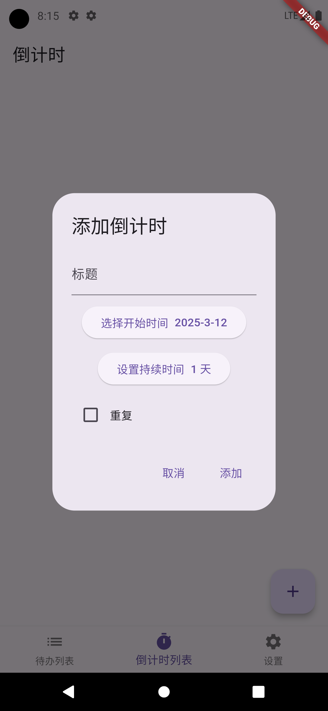

# memo

一个轻量清单软件，方便记录一些事情

## 技术栈

- fvm
- flutter 3.27.3

## TODO

- [ ] 同步后自动刷新重新初始化数据库
- [ ] 任务输入框间断
- [ ] 倒计时任务最大365天
- [ ] 配置webdav后自动刷新界面

## 功能

- [x] 代办列表
- [x] 倒计时列表
- [x] webdav 同步功能

## 展示

### 代办列表

### 倒计时列表

### 设置界面

